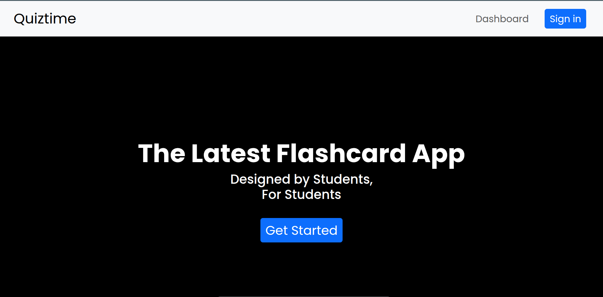

# Quiztime

A full-stack Flashcard application designed to help users create, manage, and study flashcards. The project is still under development, with planned features and improvements to optimize the learning experience.

## Features

- **User Authentication**: Register and log in to securely manage your flashcards.
- **Create Flashcards**: Easily create custom flashcards, including multiple-choice options.
- **Study Mode**: Review flashcards in a clean, responsive interface.
- **Responsive Design**: Optimized for desktop and mobile views.

## Project Structure

The project is organized into separate frontend and backend folders to streamline development and deployment:

- **Frontend**: React-based client-side application located in the `frontend` directory.
- **Backend**: Node.js + Express server in the `server` directory, handling the API and database interactions.

## Tech Stack

- **Frontend**: React, React-Bootstrap, Formik
- **Backend**: Node.js, Express
- **Database**: PostgreSQL
- **API**: RESTful API for flashcard management

## Getting Started

To run the project locally, clone the repository and install dependencies in both the frontend and backend folders.

### Installation

1. **Clone the repository**:
   ```bash
   git clone https://github.com/RishiJain905/flashcard-project.git
   cd flashcard-project
2. **Install dependencies**:
    Ensure npm is intalled, then run
    ```bash
    cd ./vite-frontend
    npm run dev
    cd ../server
    node --watch server.js

### Environmental Variables
The backend server will require environment variables to connect to a database or handle authentication. Create a .env file in the server directory with the following keys:

```bash
DB_HOST=<database_host>
DB_USER=<database_user>
DB_PASSWORD=<database_password>
DB_NAME=<database_name>
JWT_SECRET=<your_jwt_secret>
```
### Current Status
This project is a work in progress, with ongoing work on refining flashcard creation, enhancing user experience, and implementing study modes. Check back for updates!

### Contributing
Contributions are welcome! Feel free to fork the repository, create a feature branch, and submit a pull request. Please open an issue to discuss any significant changes.

